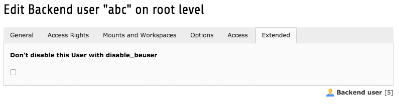
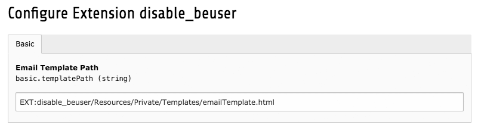

.. ==================================================
.. FOR YOUR INFORMATION
.. --------------------------------------------------
.. -*- coding: utf-8 -*- with BOM.

.. include:: ../Includes.txt

.. _admin-manual:

Administrator Manual
====================

Target group: **Administrators**

.. note::
	The task don't disable Administrators, Backend User which start with "_cli_" and excluded User.

Installation
------------

Just install with Extension Manager and create a new scheduler task "Disable Beuser".

Now you have the possibilty to exclude single User From this Task

Optional:
You can set an individual HTML E-Mail Template in ExtensionManager Configuration

Configuration
------------

**Input field: "Time of Inactivity to disable Beuser"**

Here you have to set a time span e.g. "1 months". You have to use a correkt  (PHP) Date/Time Format.

valid examples are:

1 day

1 week

1 month

1 year

10 days

10 weeks

10 months

10 years

invalid examples are:

ein Tag

1 Woche

one months

Background:
The scheduler task create a Datetime Object and subtract the time span from "now".

**Input field: "Notification Email (optional) "**

If you set an email address you get the date and a list with disabled user from the task.
(Separate Mails with ";" )

.. figure:: ../Images/AdministratorManual/disable-beuser-task.png
	:width: 500px
	:alt: Screenshot of Scheduler Task

	Disable Beuser Scheduler Task

**Input field: "TestRunner (optional) "**

with this field checked, you only make a test run and no user status where changed